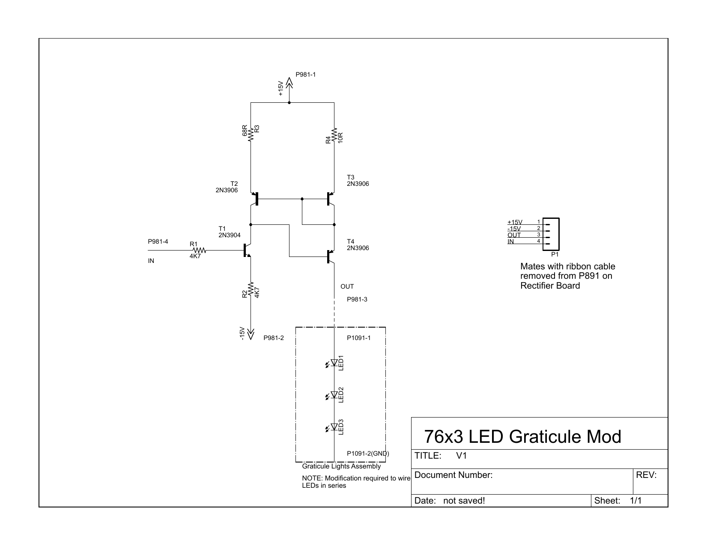

# BOM

Designator | Value | Description
---------- | ----- | -----------
LED1 | C535A-WJN-CT0W0231 | 5mm Cool White LED, 110 degrees
LED2 | C535A-WJN-CT0W0231 | 5mm Cool White LED, 110 degrees
LED3 | C535A-WJN-CT0W0231 | 5mm Cool White LED, 110 degrees
P1 | 4 pin 0.1" header |
R1 | 4K7 | 1/4W 5%
R2 | 4K7 | 1/4W 5%
R3 | 68R | 1/4W 5%
R4 | 10R | 1/4W 5%
T1 | 2N3904 | NPN
T2 | 2N3906 | PNP
T3 | 2N2906 | PNP
T4 | 2N2906 | PNP
