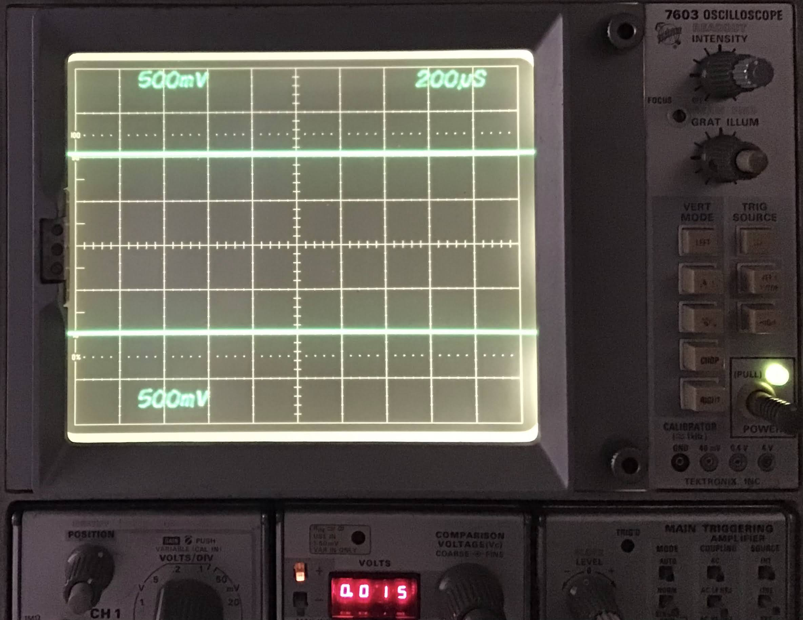
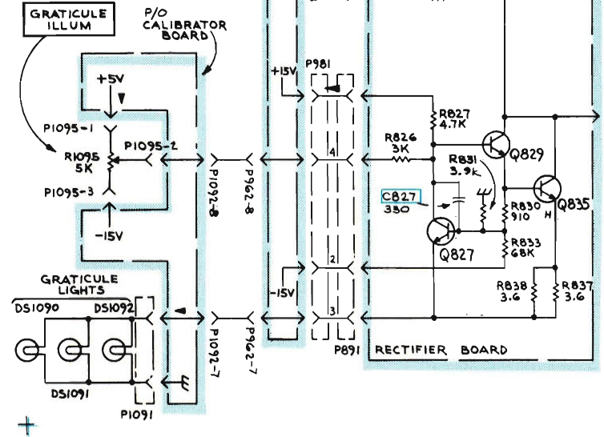
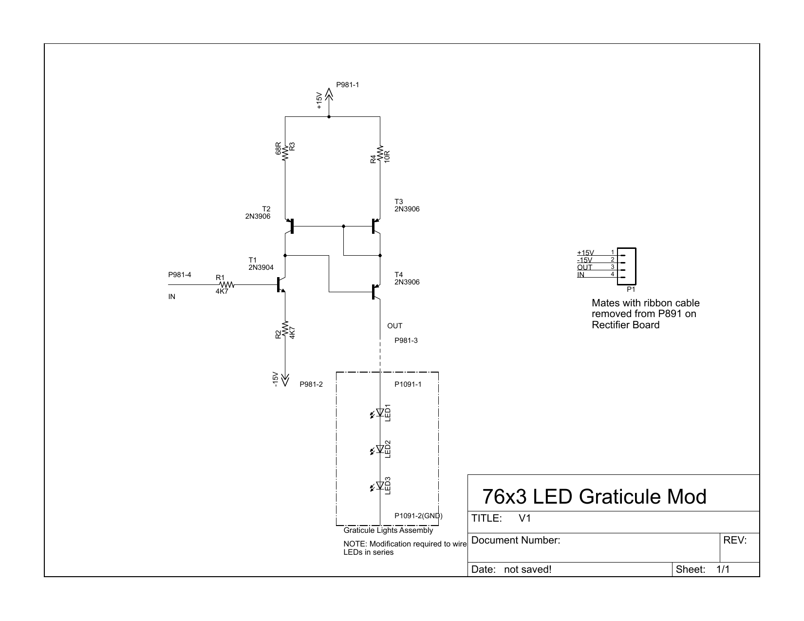
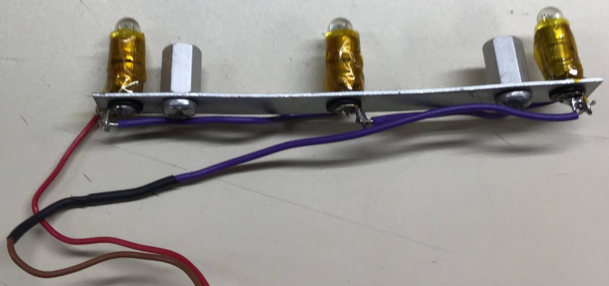
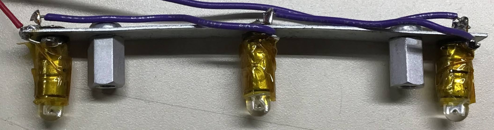
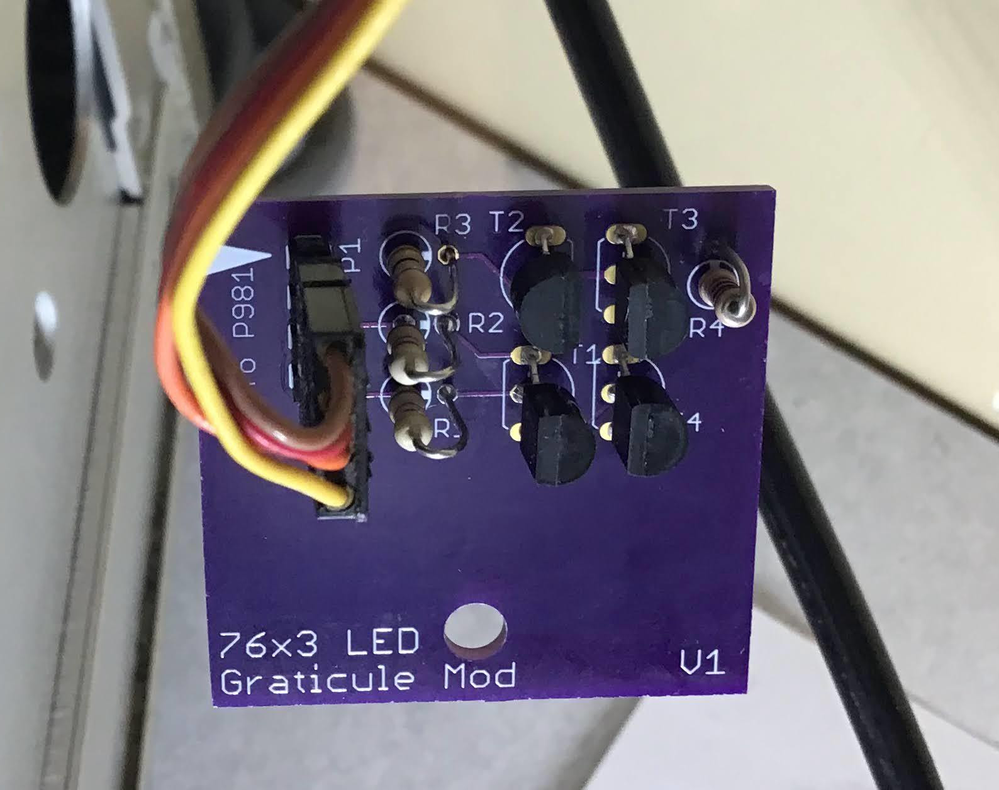
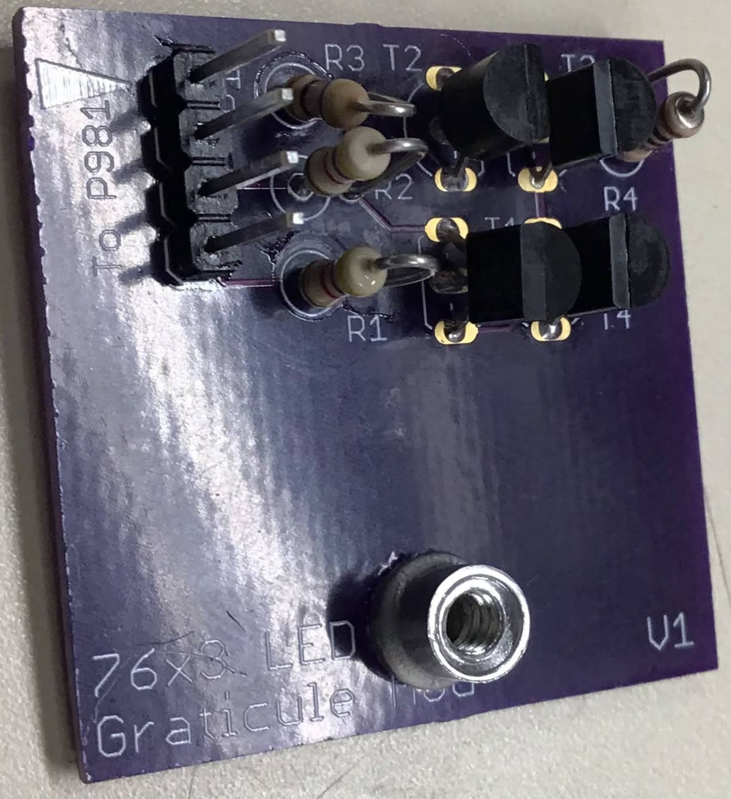
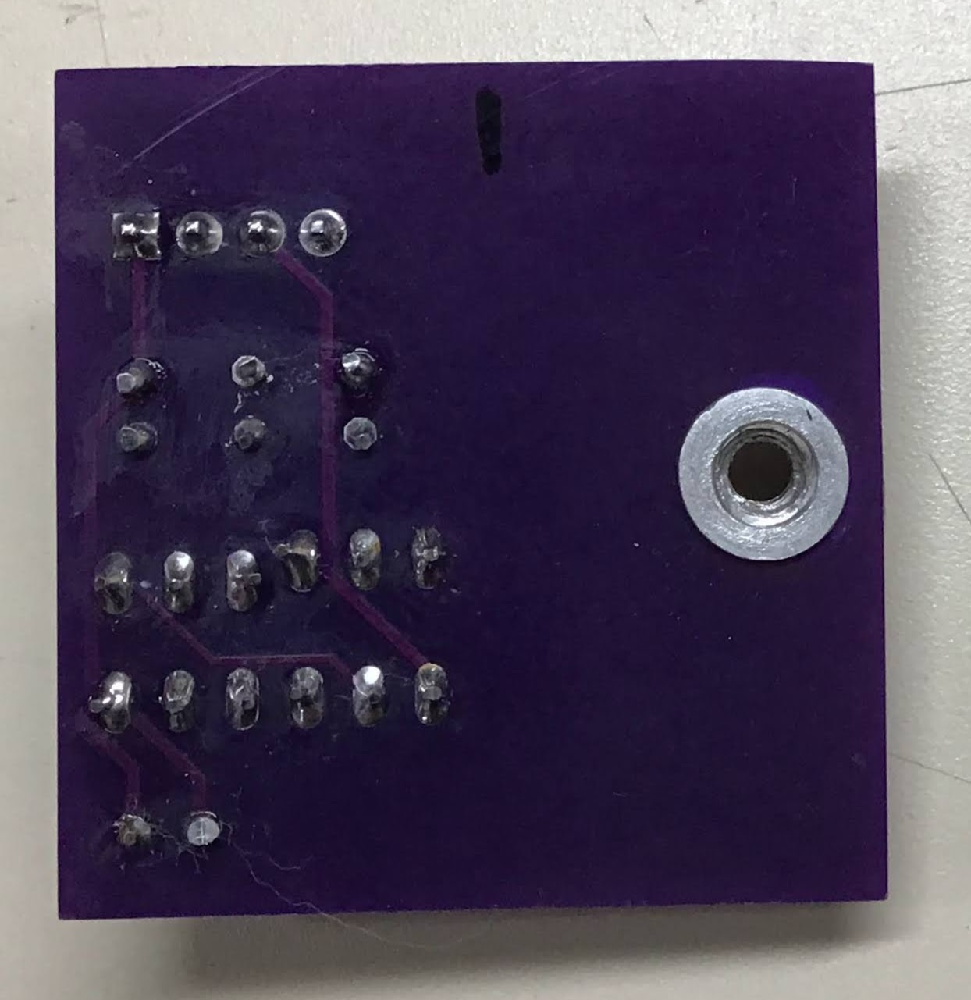
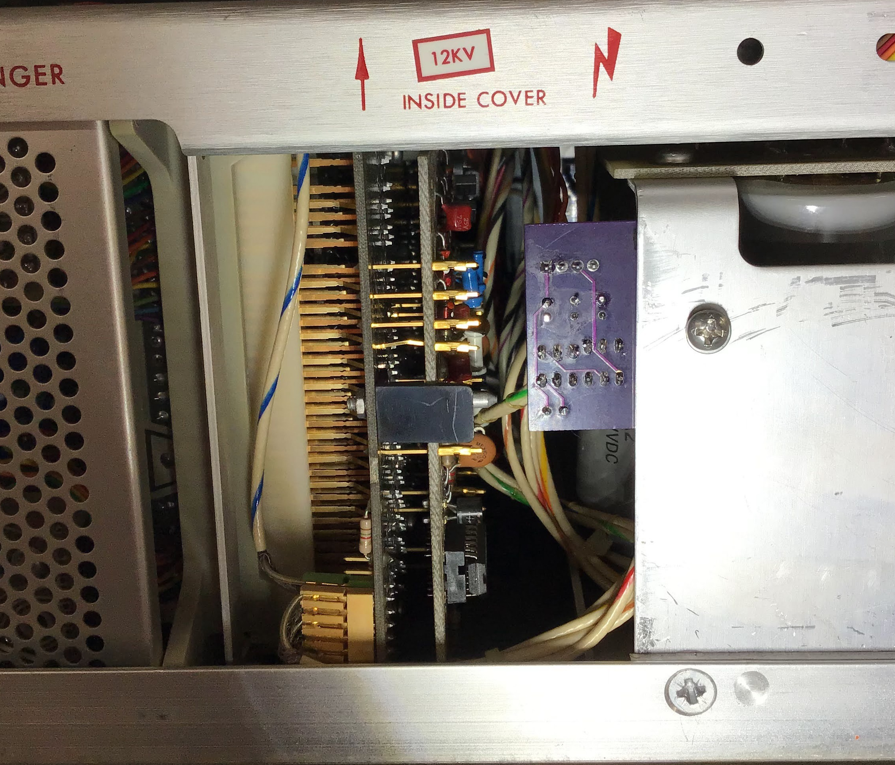
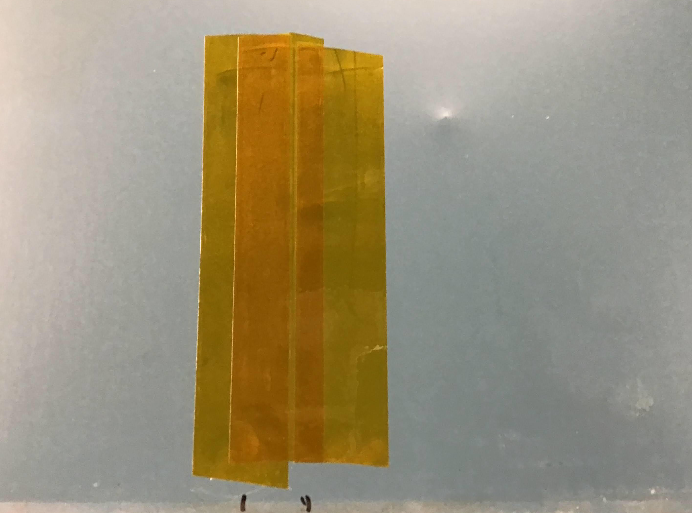

# Tek76x3LedGraticule
A project to retro-fit LED graticule lighting to Tektronix 76x3 scopes.

After retrofitting [LED graticule lighting in my 7904A](https://github.com/andyw-lala/Tek7904ALedGraticule) (which was in turn inspired by the white LED upgrade to a [Tek 7854 by Zenwizard Studios](https://youtu.be/GYkjuE7Pez8)), I decided to upgrade the graticule lights on my 7603 and 7633 scopes.

Attempts to take the simple route of just replacing the lamps with LEDs, as per [another excellent Zenwizard video](https://youtu.be/xNx9IgudV4Y) resulted in burnt out LEDs - eventually I added a dropping resistor, but was unhappy with the result - specifically the adjustment range, so I kept digging.
The control circuitry in the 76x3 scopes will current limit, so I initially investigated adjusting the current limit sense circuitry to limit the max current to a safe level for the LEDs, but that resulted in even less useful adjustment range from the front panel control.

Like the 7904A retrofit, this design completely replaces the existing incandescent graticule lamp driver circuit with a variable current source, while honoring the existing control mechanism.

## Theory of Operation

The 76x3 mainframes control the graticule illumination by means of a front panel variable resistor (R1095) and circuitry on the rectifier PCB (A11) at the rear of the unit. R1095 provides a voltage between -15V (graticule off) and +5V (graticule max). This voltage is applied to Q829, Q835, & Q827 and associated passives to provide a current limited variable voltage to three incandescent lamps that are wired in parallel. A single 4-way ribbon cable carries +15V, -15V, the control signal from R1095 and the output to the graticule lamp assembly (A13.) This cable mates with P891 on the rectifier board where the control circuit resides.

In a similar manner to the 7904A retrofit, the replacement circuit uses the same control signal (-15 to +5 volts) to control an approximately 0 - 20 mA current to ground that is used to drive the LEDs, which are re-wired to be in series.

The -15 to +5V control voltage from R1095 drives the base of T1, resulting in a 0 - 4 mA T1 collector current. In order drive a current to ground and preserve the nature of the graticule lamp assembly connections, this 0 - 4 mA control current is mirrored by T2, T3, & T4 acting as a [Wilson current mirror](https://en.wikipedia.org/wiki/Wilson_current_mirror), however due to the differing values of R3 & R4, the resultant current between the collector of T4 and ground varies between 0 and approximately 20 mA. As in the 7904A retrofit design, the exact fidelity of the current mirror is not important, so discrete, unmatched transistors are used.

Since all the required signals are present on the ribbon cable that normally connects to P891 on the rectifier board, a small PCB was designed to accept the ribbon cable instead. Installation comprises of removing the ribbon connection to P891 (which can be done without removing the power supply assembly from the case.)

The graticule light assembly is modified to replace the lamps with wide angle white LEDs,and to wire the LEDs in series.

## [Schematic](V1.pdf) (pdf)

## [BOM](BOM.md)

## Eagle Files
* [Schematic](V1.sch)
* [Board](V1.brd)

## Gerber Files
Here are generated gerbers, so you can use your PCB house of choice.
Note that I have only checked these with a viewer, I ordered my boards direct from OSHPark using the eagle board file. Send feedback if you use these files and they work or don't work.
* [Gerber zipfile](V1_gerbers.zip)

## Order Boards
You can order multiples of three known good boards directly from [OSHpark](https://oshpark.com/shared_projects/Er36gqKW).

## Installation
After assembling the board, installation consists of the following steps:
* Disconnection of P891 4-pin connector from rectifier board, and re-routing of 4-conductor ribbon cable.
* Removal, rework, and re-installation of graticule lamp assembly.
* Mounting of new PCB in a suitable location.
* Connection of P891 4-pin connector to new PCB.
### Disconnection of P891 from rectifier board
It is possible to unplug the 4-pin ribbon cable that plugs into P891 on the rectifier board without removal of the rectifier board and transformer assembly. With the power off, everything discharged, and the left cover removed; it is possible to work a narrow screwdriver or other tool in from the left hand side to work the connector loose while gently pulling on the ribbon cable. Once the connector is free of the rectifier board, gently untangle it from all the other ribbon and coax cables in the vicinity, to gain the maximum working length. Take care not to force other cables into the path of the fan which is nearby in some models.
### Removal of existing graticule lamp assembly
On the 7603, the graticule lamp assembly is mounted vertically to the left of the CRT. Remove the two knurled screws to the left of the CRT, and gently remove the front bezel and implosion shield. There should be a white diffuser (as shown [around here in Zen's youtube video](https://youtu.be/xNx9IgudV4Y?t=40).) Remove this and the spring that holds it in place. Remove the two mounting screws that bolt the assembly to the chassis, and work the existing lamp assembly free from the back. You can either rework the assembly while it is still connected to the scope, or remove it from the scope by unplugging the 2 pin connector from the calibrator board.
### Reworking the graticule lamp assembly
Remove the lamps, and cut or desolder the wires that connect the 3 lamp sockets.
At this point you can trim the existing lamp sockets back so that they will not touch the chassis, if you wish (more on this later.) I found passing the LED positive leg (the long lead in the specified parts) through the hole in the center connector of the socket, soldering it in place and then soldering the negative leg to the outside connector of the lamp socket worked well. Wire the sockets in series using any suitable hookup wire.

Note that the outside conductor of the lamp sockets can, and most likely will, be grounded by contact with the chassis when the assembly is in place, this will cause one or more LEDs not to light, no damage will occur as the current is limited to ~20mA, but the lighting is uneven and very poor. This is why I suggest trimming the metal of the lamp sockets back, but for my first 7603 rework, I used kapton tape to insulate the lamp sockets.

### Reinstallation of graticule lamp assembly
The graticule lamp assembly is installed by reversing the steps for removal. Note that depending on how far the LEDs protrude through the chassis, the registration of the diffuser may not be quite as positive, but it has not been a problem in my experience.

Feel free to test at this point, but only if you are experienced enough to operate the scope with the side cover removed. Simply plug the ribbon cable into the PCB (pay close attention to orientation) while ensuring that the PCB is not touching any parts of the scope.

If none of the LEDs light, try reversing the 2-pin connector between the graticule lamp assembly and the calibrator board.

If one or more, but not all, of the LEDs light, then you have a short to chassis ground at the lamp assembly.

You should be able to vary the LED brightness using the normal front panel control and the diffuser should spread the light fairly evenly across the face of the CRT.

### Mounting new PCB in a suitable location
You are free to mount the PCB wherever you can find a suitable stable mechanical mounting point that the ribbon cable will reach. I ended up carefully drilling a suitable hole for a machine screw in the left side wall of the transformer/rectifier assembly. I was careful to remove all swarf immediately after drilling the hole with a vacuum and a brush. After struggling to hold a nut in place with the board in place, I resorted to installing a threaded bushing on the PCB.

I recommend mounting the PCB so that if the mounting bolt works loose and the board rotates, it is unable to rotate far enough to short pins to the chassis.

I also applied some additional kapton tape to the inside of the side cover, to reduce the chance of shorts if the side cover was pressed at just the wrong place.

The mounting location for the PCB is completely non-critical, as long as it is safe, mechanically sound, and the ribbon cable can reach. Feel free to devise your own arrangement (pull requests with alternate ideas welcome.)

### Connection of P891 4-pin connector to new PCB
When connecting the 4-pin connector that used to go to the rectifier board, play close attention to the orientation. Pin 1 is clearly marked on the PCB, line the arrow on the connector up with the pin that the arrow on the PCB points to.

### Final testing
Close up the case, ensure all cables are dressed well, and none are in the way of the fan, and perform a final test after the covers are all buttoned up.

# Licence
All work here is covered by the MIT Licence, which is simple and permissive.

# Disclaimer
This mod worked well for me, and is presented here in the hope it can be as useful to others. However, do not undertake this unless you have the skills to perform the work safely and without damaging anything. You perform all work at your own risk, and I have no responsibility for any damage or injury whatsoever.
